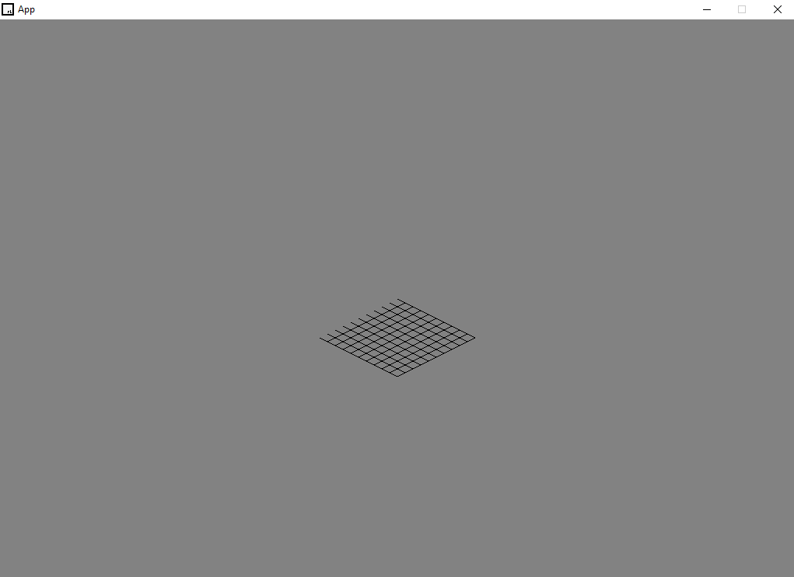

# cpp_isometric_grider
 c++ isometric grid using raylib
 we've used: https://www.youtube.com/watch?v=04oQ2jOUjkU

 now we need to use: https://www.youtube.com/watch?v=kYB8IZa5AuE
    to  better update this

## screenshots

### ideas

- we should have a base class for ui elements
    - vars:
        - would hold ui location
        - the orientation of that element
            - as in an enum for top-left/centre etc
        - the dimensions
    - functions:
        - paint
        - contains
        - setLoc
        - getLoc
        - setSize
        - getSize